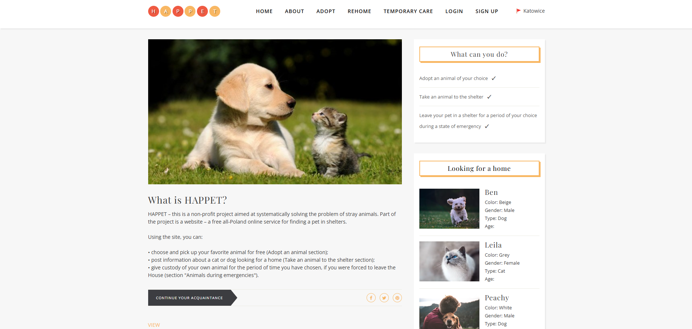
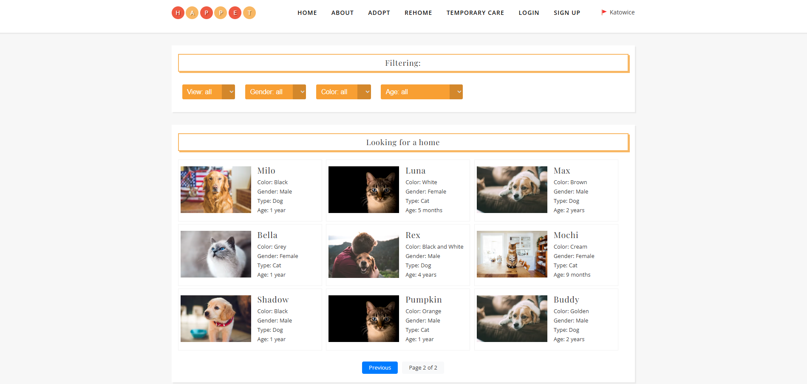
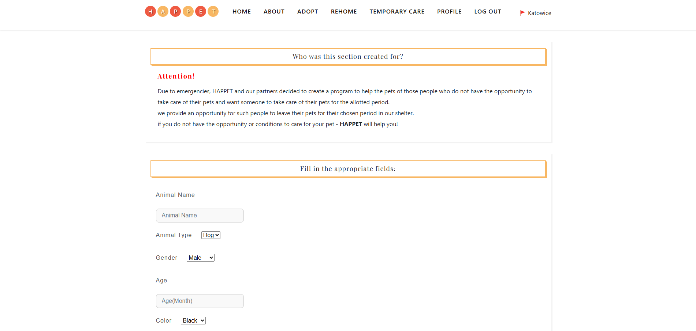

# g2App - Animal Shelter Management System

## Project Overview

g2App is a web-based platform designed to facilitate the management of an animal shelter. The project allows users to register, add animal profiles, and manage the adoption process efficiently. The system includes user authentication, data management, and administrative functionalities.

This project was developed as a group effort, with team members contributing to various aspects of the system using GitHub Project for task management and collaboration.

### Home Page

## Code Structure

g2App follows a structured Flask backend with an MVC (Model-View-Controller) pattern:

- **app/**: Contains the main application logic, including routes, models, and forms.
  - **models.py**: Defines the database schema using SQLAlchemy, including `User` and `Animal` models.
  - **routes.py**: Handles HTTP requests, including user authentication, animal management, and adoption workflows.
  - **forms.py**: Implements WTForms for handling user inputs.
  - **templates/**: HTML templates for rendering web pages.
  - **static/**: Contains CSS and JavaScript files for frontend styling and functionality.
- **tests/**: Includes unit and integration tests for validating the application's functionality.
- **config.py**: Configuration settings for the application, including database and security settings.
- **run.py**: Entry point for running the Flask application.

### Rehome Page

## Testing

The project includes a comprehensive test suite to ensure stability and correctness.

### Unit Tests
- **test_models.py**: Verifies the functionality of the `User` and `Animal` models, ensuring correct data storage and retrieval.
- **test_forms.py**: Tests form validation for user registration and animal data entry.
- **test_routes.py**: Ensures API endpoints function correctly, including user authentication and animal adoption workflows.

### Integration Tests
- **test_app.py**: Checks the overall application functionality, including database initialization and configuration.
- **test_register.py**: Validates user registration, handling edge cases like missing fields and incorrect inputs.

## Development Workflow

GitHub Project was used to manage tasks effectively:

This workflow ensured a clear division of tasks and seamless collaboration among team members.

### Temporary Care

### 🧑‍💻 Team Members & Contributions

- **[Mert Güldal](https://github.com/mertgldal)**  
  - Backend development  
  - Integration of frontend and backend  
  - API design & documentation  
  - Testing & Quality Assurance  
  - Deployment & Maintenance  
  - Version control & branch management

- **[Oleksandr Yurchak](https://github.com/Alex121512)**  
  - Frontend development  
  - Project Documentation  
  - UI/UX alignment & component integration
  

- **[Yostina Shiferaw](https://github.com/yostinas)**  
  - Project Documentation  
  - Project Review & Presentation  
  - Animal Data & Adoption Workflow  
  - User Feedback Collection & Analysis

- **[Gulsezim Bigali](https://github.com/gulsezyym)**  
  - Project Documentation  
  - Project Review & Presentation  
  - Animal Data & Adoption Workflow  
  - Workflow Diagrams & Process Mapping

- **[Zakir Huseynov](https://github.com/zakirh13)**  
  - Project Documentation  
  - Project Review & Presentation  
  - Animal Data & Adoption Workflow  
  - Database Schema Suggestions

- **[Life Tafare](https://github.com/Litafe)**  
  - Project Documentation  
  - Project Review & Presentation  
  - Animal Data & Adoption Workflow  
  - Testing & Bug Reporting

